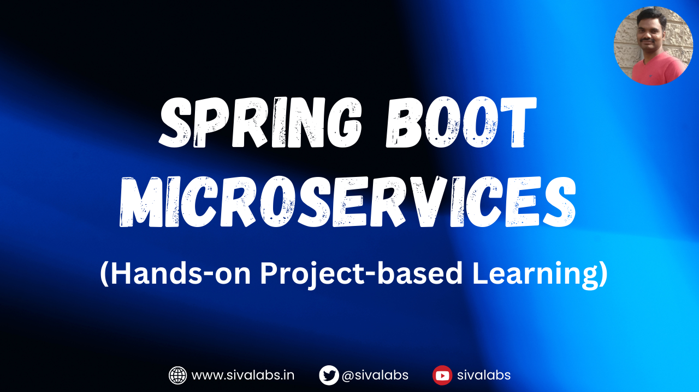
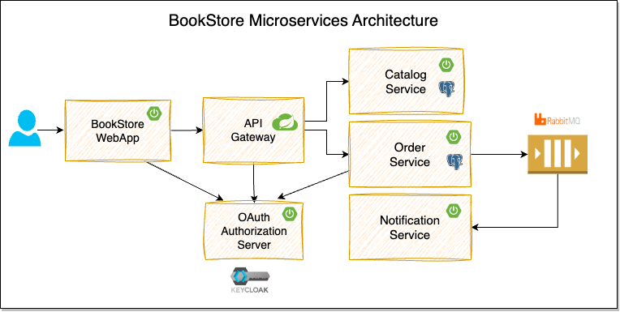

# Spring Boot Microservices Course
This repository contains the source code for the [Spring Boot Microservices Course](https://www.youtube.com/playlist?list=PLuNxlOYbv61g_ytin-wgkecfWDKVCEDmB).

We will build a BookStore application using Spring Boot, Spring Cloud, and Docker.

## Modules
* **catalog-service**: 
  This services provides REST API for managing catalog of products(books).
  
  **TechStack:** Spring Boot, Spring Data JPA, PostgreSQL

* **order-service**: 
  This service provides the REST API for managing orders and publishes order events to the message broker.

  **TechStack:** Spring Boot, Spring Security OAuth2, Keycloak, Spring Data JPA, PostgreSQL, RabbitMQ

* **notification-service**: 
  This service listens to the order events and sends notifications to the users.
  
  **TechStack:** Spring Boot, RabbitMQ

* **api-gateway**: 
  This service is an API Gateway to the internal backend services (catalog-service, order-service).

  **TechStack:** Spring Boot, Spring Cloud Gateway

* **bookstore-webapp**: 
  This is the customer facing web application where customers can browse the catalog, place orders, and view their order details. 

  **TechStack:** Spring Boot, Spring Security OAuth2, Keycloak, Thymeleaf, Alpine.js, Bootstrap

## Learning Objectives
* Building Spring Boot REST APIs
* Database Persistence using Spring Data JPA, Postgres, Flyway
* Event Driven Async Communication using RabbitMQ
* Implementing OAuth2-based Security using Spring Security and Keycloak
* Implementing API Gateway using Spring Cloud Gateway
* Implementing Resiliency using Resilience4j
* Job Scheduling with ShedLock-based distributed Locking
* Using RestClient, Declarative HTTP Interfaces to invoke other APIs
* Creating Aggregated Swagger Documentation at API Gateway
* Local Development Setup using Docker, Docker Compose and Testcontainers
* Testing using JUnit 5, RestAssured, Testcontainers, Awaitility, WireMock
* Building Web Application using Thymeleaf, Alpine.js, Bootstrap
* Monitoring & Observability using Grafana, Prometheus, Loki, Tempo

## Local Development Setup
* Install Java 21. Recommend using [SDKMAN](https://sdkman.io/) for [managing Java versions](https://youtu.be/ZywEiw3EO8A).
* Install [Docker Desktop](https://www.docker.com/products/docker-desktop/)
* Install [IntelliJ IDEA](https://www.jetbrains.com/idea) or any of your favorite IDE
* Install [Postman](https://www.postman.com/) or any REST Client

## Other Learning Resources
* [SivaLabs Blog](https://sivalabs.in)
  * [Spring Boot Tutorials](https://www.sivalabs.in/spring-boot-tutorials/)
  * [Kubernetes Tutorials](https://www.sivalabs.in/getting-started-with-kubernetes/)
  * [Spring Security OAuth 2.0 Tutorials](https://www.sivalabs.in/spring-security-oauth2-tutorial-introduction/)
  * [A Pragmatic Approach to Software Design](https://www.sivalabs.in/tomato-architecture-pragmatic-approach-to-software-design/)
* [SivaLabs YouTube Channel](https://www.youtube.com/c/SivaLabs)
  * [Spring Boot Tips Series](https://www.youtube.com/playlist?list=PLuNxlOYbv61jFFX2ARQKnBgkMF6DvEEic)
  * [Spring Boot + Kubernetes Series](https://www.youtube.com/playlist?list=PLuNxlOYbv61h66_QlcjCEkVAj6RdeplJJ)
  * [Spring Boot : The Missing Guide](https://www.youtube.com/playlist?list=PLuNxlOYbv61jZL1IiciTgWezZoqEp4WXh)
  * [Java Testing Made Easy: Learn writing Unit, Integration, E2E & Performance Tests](https://www.youtube.com/playlist?list=PLuNxlOYbv61jtHHFHBOc9N7Dg5jn013ix)
